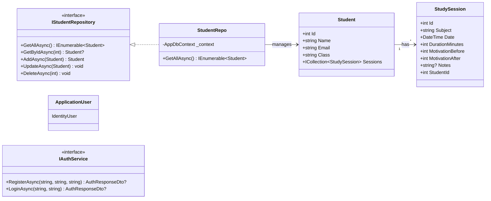

<div align="center">

[](#)
[](#)
[](#)
[](#)
[](#)
[](#)

<br/>

Ett ASP.NET Core Web API byggt enligt **Clean Architecture**.<br/>
Elever loggar studiepass med motivation före/efter — för att synliggöra hur studier påverkar måendet och bygga motivation över tid.

</div>

<br/>

## &nbsp;Kör programmet

```bash
# 1. Sätt JWT-secret i user-secrets (committas aldrig till repo)
dotnet user-secrets set "Jwt:Secret" "<minst-32-tecken-lång-slumpad-sträng>" --project StudyTracker.API

# 2. Skapa databasen (SQL Server Express)
dotnet ef database update --project StudyTracker.Infrastructure --startup-project StudyTracker.API

# 3. Starta API:et
dotnet run --project StudyTracker.API
```

> [!NOTE]
> Kräver **.NET 10 SDK** och **SQL Server Express**. Anpassa connection string i `StudyTracker.API/appsettings.Development.json` efter din lokala instans.
>
> Vid uppstart skapas rollerna `Admin` / `User` samt en seedad admin-användare: `admin` / `Admin123!` (ändras via `Seed:AdminPassword` i konfigurationen).
>
> API:et vägrar starta om `Jwt:Secret` saknas, är kvar på placeholder-värdet, eller är kortare än 32 bytes — fail fast hellre än att köra med svag nyckel.

<br/>

## &nbsp;Projektstruktur

```
StudyTracker/
├── StudyTracker.slnx
├── StudyTracker.API/                     # Controllers, Program.cs, Scalar, JWT-konfig
│   ├── Controllers/
│   │   ├── StudentsController.cs         # [Authorize] + [Authorize(Roles="Admin")]
│   │   ├── StudySessionsController.cs
│   │   └── AuthController.cs             # register / login
│   ├── ExceptionHandlers/                # ValidationException → 400
│   └── Program.cs
├── StudyTracker.Application/             # Commands, Queries, Handlers, Validators, DTOs
│   ├── Auth/Commands/                    # Register, Login
│   ├── Common/
│   │   ├── Behaviors/ValidationBehavior.cs   # MediatR pipeline
│   │   ├── Mappings/MappingProfile.cs        # AutoMapper
│   │   └── Constants/Roles.cs
│   ├── DTOs/                             # Student-, StudySession-, Auth-DTOs
│   ├── Interfaces/                       # IStudentRepository, IAuthService
│   ├── StudentCRUD/
│   │   ├── Commands/                     # Create, Update, Delete
│   │   └── Queries/                      # GetAll, GetById
│   ├── StudySessionCRUD/
│   ├── Validators/                       # FluentValidation
│   └── DependencyInjection.cs            # AddApplication()
├── StudyTracker.Domain/                  # Entities (inga paketberoenden)
│   └── Models/
│       ├── Student.cs
│       └── StudySession.cs
└── StudyTracker.Infrastructure/          # EF Core, Identity, JWT
    ├── Database/AppDbContext.cs          # IdentityDbContext<ApplicationUser>
    ├── Identity/ApplicationUser.cs
    ├── Identity/IdentitySeeder.cs
    ├── Migrations/
    ├── Repositories/
    ├── Services/AuthService.cs           # JWT-generering
    └── DependencyInjection.cs            # AddInfrastructure()
```

**Beroenden pekar inåt:** `API` → `Application` + `Infrastructure` → `Application` → `Domain`. Domain känner inte till några andra lager.

<br/>

## &nbsp;Features

<table>
<tr>
<td width="50%" valign="top">

### Clean Architecture


**Problem:** Affärslogik, datatillgång och HTTP-hantering tenderar att blanda sig och göra kodbasen svårunderhållen.

**Lösning:** 4 separata projekt där beroendena pekar inåt mot Domain. EF Core och ASP.NET Identity är isolerade till Infrastructure.

**Filer:** `StudyTracker.Domain/`, `StudyTracker.Application/Interfaces/`

</td>
<td width="50%" valign="top">

### CQRS + MediatR


**Problem:** Blandad läs- och skrivlogik i samma service gör det svårt att testa och skala.

**Lösning:** Commands och Queries separeras i `StudentCRUD/Commands/` och `StudentCRUD/Queries/`. Controllers anropar endast `_mediator.Send(...)`.

**Filer:** `StudyTracker.Application/StudentCRUD/`, `StudySessionCRUD/`

</td>
</tr>
<tr>
<td width="50%" valign="top">

### JWT + RBAC


**Problem:** API:et behöver skydda skrivoperationer och tillåta olika åtkomstnivåer.

**Lösning:** JWT Bearer-tokens signerade med HMAC-SHA256. Rollerna `Admin` / `User` seedas vid uppstart. Skrivendpoints kräver `[Authorize(Roles = "Admin")]`.

**Filer:** `StudyTracker.Infrastructure/Services/AuthService.cs`, `Identity/IdentitySeeder.cs`

</td>
<td width="50%" valign="top">

### AutoMapper + Validation


**Problem:** Entiteter bör aldrig exponeras från API:et, och ogiltiga requests måste stoppas innan de når databasen.

**Lösning:** AutoMapper mappar `Student` → `StudentDto`. `ValidationBehavior` (MediatR-pipeline) kör FluentValidation **före** handlers och kastar ValidationException → 400.

**Filer:** `Common/Mappings/MappingProfile.cs`, `Common/Behaviors/ValidationBehavior.cs`, `Validators/`

</td>
</tr>
</table>

<br/>

## &nbsp;CQRS-flöde

```
HTTP Request → Controller → _mediator.Send(Command)
                                      ↓
                      ValidationBehavior (FluentValidation)
                                      ↓
                    CreateStudentCommandHandler : IRequestHandler<>
                                      ↓
                           IStudentRepository.AddAsync()
                                      ↓
                              AppDbContext.SaveChangesAsync()
                                      ↓
                                  SQL INSERT
                                      ↓
                       Entity → AutoMapper → DTO
                                      ↓
                        HTTP 201 Created + StudentDto
```

<br/>

## &nbsp;Klassdiagram



<br/>

## &nbsp;Teknisk sammanfattning

<table>
<tr>
<td width="25%" align="center"><strong>SoC</strong></td>
<td>Fyra lager, tydligt avgränsade ansvar. Domain vet inget om EF Core eller Identity.</td>
</tr>
<tr>
<td align="center"><strong>SOLID</strong></td>
<td>SRP i varje handler (en Command = en åtgärd). DIP via repository-interfaces som implementeras i Infrastructure.</td>
</tr>
<tr>
<td align="center"><strong>CQRS</strong></td>
<td>Commands för mutationer, Queries för läsning. MediatR löser routing, Pipeline Behaviour kör validering före handlers.</td>
</tr>
<tr>
<td align="center"><strong>Säkerhet</strong></td>
<td>JWT HMAC-SHA256, lösenord hashade via ASP.NET Identity, role-claims i token, skrivendpoints begränsade till Admin.</td>
</tr>
</table>

<br/>

## &nbsp;Endpoints

| Metod | Endpoint | Auth | Beskrivning |
|---|---|---|---|
| POST | `/api/auth/register` | — | Registrera ny användare (får rollen `User`) |
| POST | `/api/auth/login` | — | Logga in, returnerar JWT |
| GET | `/api/students` | Inloggad | Lista alla elever |
| GET | `/api/students/{id}` | Inloggad | Hämta elev (inkl. sessions) |
| POST | `/api/students` | **Admin** | Skapa elev |
| PUT | `/api/students/{id}` | **Admin** | Uppdatera elev |
| DELETE | `/api/students/{id}` | **Admin** | Radera elev (cascade till sessions) |
| GET | `/api/studysessions` | Inloggad | Lista alla studiepass |
| GET | `/api/studysessions/{id}` | Inloggad | Hämta studiepass |
| POST | `/api/studysessions` | **Admin** | Skapa studiepass |
| PUT | `/api/studysessions/{id}` | **Admin** | Uppdatera studiepass |
| DELETE | `/api/studysessions/{id}` | **Admin** | Radera studiepass |
| GET | `/health` | — | Health-check (DbContext-readiness) |
| GET | `/scalar/v1` | — | Interaktiv API-dokumentation (Scalar, med Authorize-knapp för JWT) |

<br/>

## &nbsp;Reflektion

Det som tog mest tid var inte koden i sig — det var att hålla isär lagren. Första instinkten var att låta Application veta om EF Core eftersom repository-implementationerna naturligt drogs dit, men då skulle beroendena peka åt fel håll. Genom att lägga interfaces i Application och implementation i Infrastructure blev Domain till slut helt fri från ramverk, vilket är själva poängen med Clean Architecture.

MediatR gjorde att varje endpoint bara blev ett par rader i controllern. Pipeline Behaviour kändes först som overkill för en skolinlämning, men när valideringen kastar `ValidationException` innan den ens når handlern ser man värdet — handlarna slipper defensivt kontrollera input.

> [!IMPORTANT]
> Om jag gjort om projektet idag hade jag börjat med en Result-typ istället för `bool?` i Update/Delete-returer. Det skulle ge handlers möjlighet att returnera både "hittades inte" och andra affärsfel (t.ex. "email används redan") på ett uniformt sätt utan exceptions.

<br/>

## &nbsp;Författare

<div align="center">

<a href="https://github.com/klasolsson81">

</a>

### Klas Olsson

[](https://klasolsson.se)

<br/>

[](https://klasolsson.se)
[](https://linkedin.com/in/klasolsson81)
[](mailto:klasolsson81@gmail.com)
[](https://github.com/klasolsson81)

</div>


